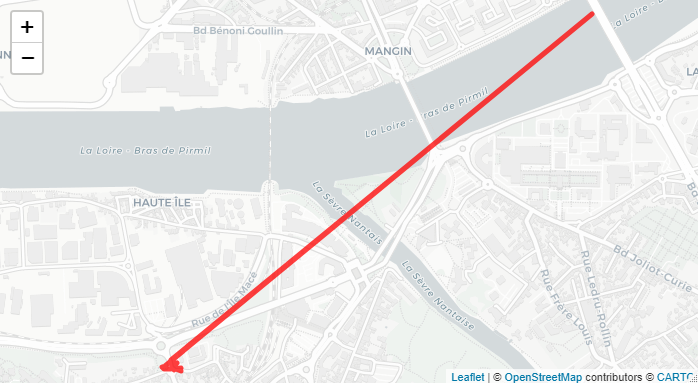
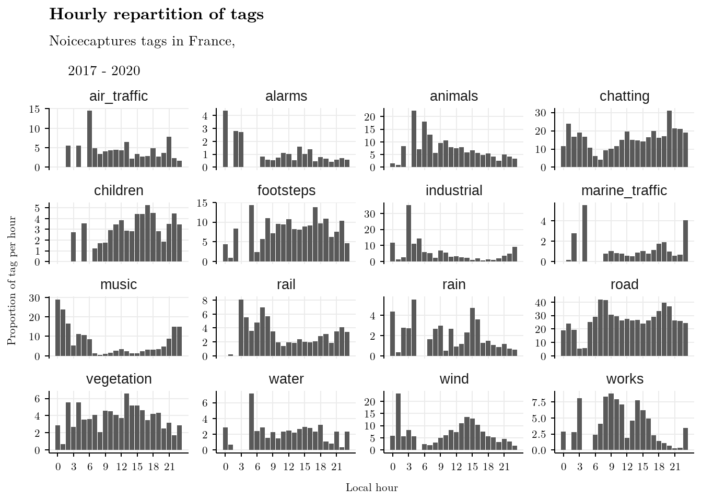
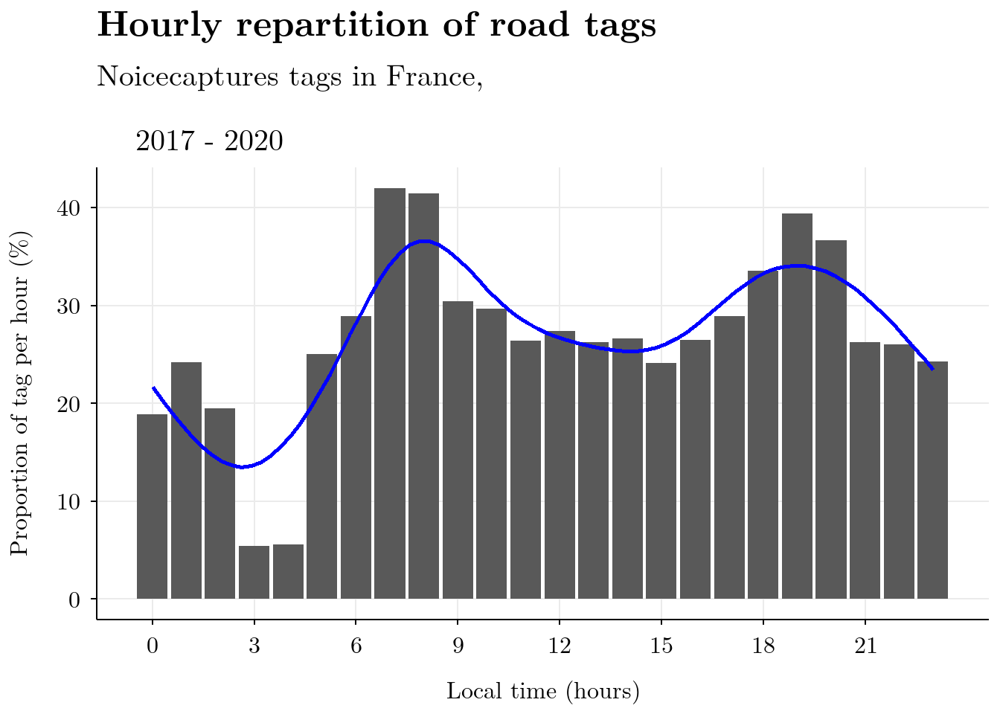
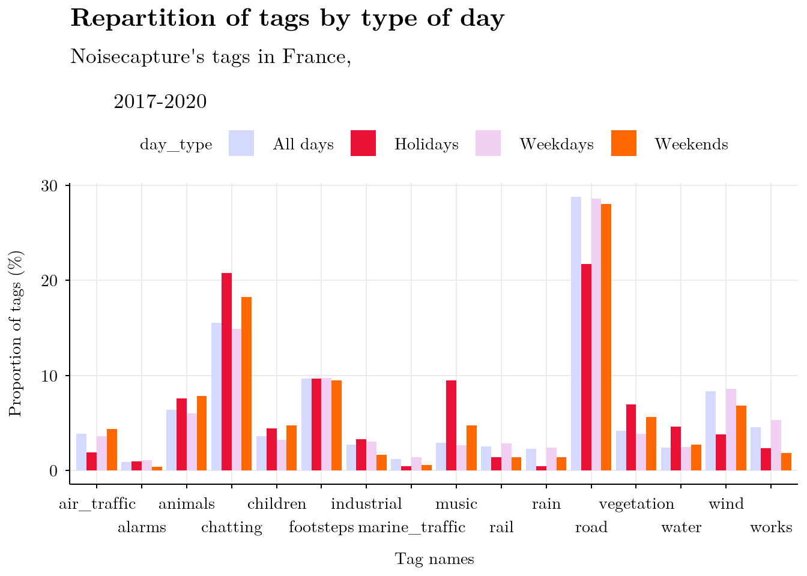
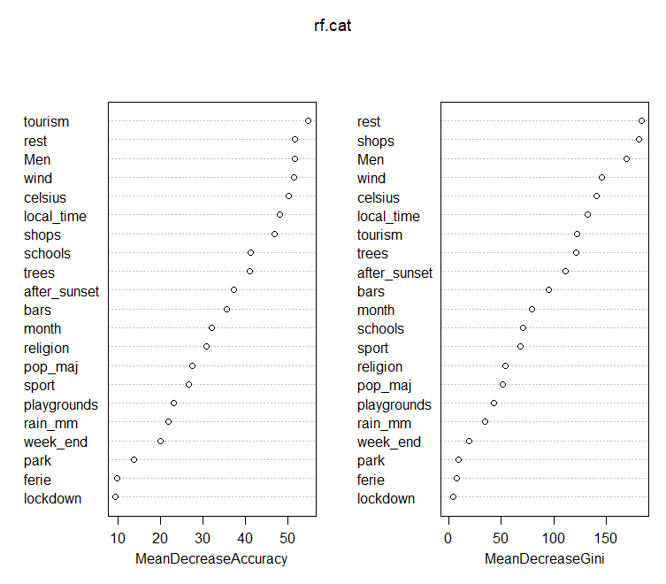
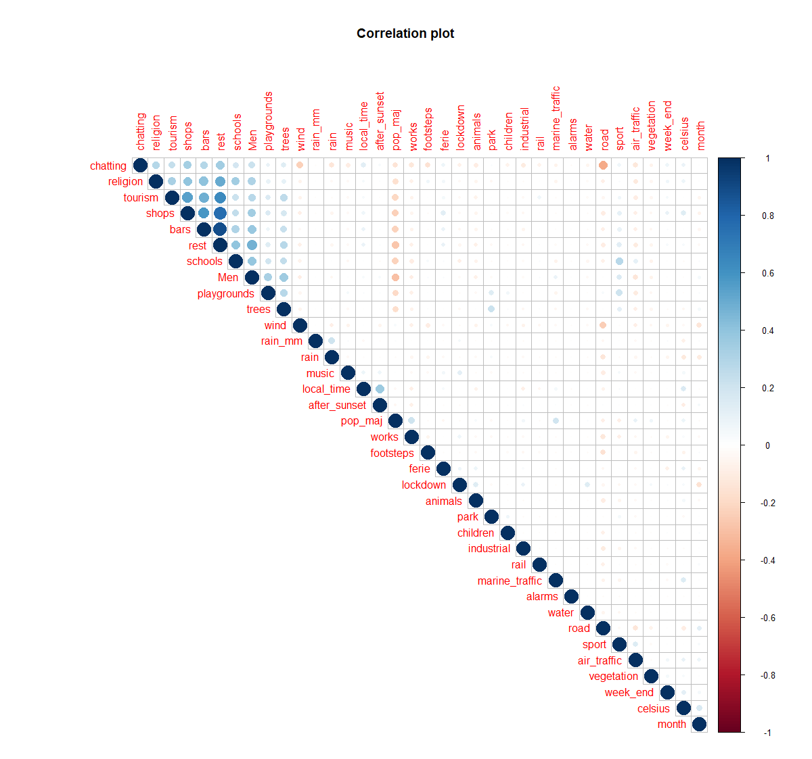

<!-- YAML header + css for html output (shiny runtime optional) -->

<!-- runtime: shiny -->
<!-- output:  -->
<!--   html_document: -->
<!--     toc: TRUE -->
<!--     toc_float: TRUE -->
<!--     theme: united -->
<!--     number_sections: true -->

<!-- <style> -->
<!-- body { -->
<!-- text-align: justify} -->
<!-- </style> -->

```{r setup, include=FALSE}
library(here)

library(captioner)
library(knitr)
library(kableExtra)
library(ltxplot)

library(leaflet)
library(shiny)

library(tidyr)
library(dplyr)
library(purrr)
library(sf)

```


```{r full-data, include = FALSE}
here::i_am("vignettes/Rapport.Rmd")
#all_info_tempo <- readRDS(here::here("data","all_info_tempo.rds"))
full_spatiotempo_fr <- readRDS(here::here("data","full_spatiotempo_fr2.rds"))
DT <- readRDS(here::here("data","DT.rds"))
rf <- readRDS(here::here("data","rf_chat.rds"))
training <- readRDS(here::here("data","training_chat.rds"))
```

\newpage

# Introduction

NoiseCapture^[https://noise-planet.org/noisecapture.html] est une application Android développée par le laboratoire UMRAE^[https://www.umrae.fr/] de l'Université Gustave Eiffel^[https://www.univ-gustave-eiffel.fr/] et le CNRS^[https://www.cnrs.fr/] dans le cadre d'une démarche participative de cartographie du bruit dans l'environnement.
NoiseCapture est une application permettant à ses utilisateurs d'enregistrer des données sonores de leur environnement proche grâce à leur téléphone. Chaque mesure est géolocalisée et l'utilisateur est invité à labelliser ses mesures à l'aide d'étiquettes permettant de caractérisant la nature de son environnement d'enregistrement ("animaux","voiture","discussions","enfants" etc.). Dans la suite de ce document, ces étiquettes seront également appelées "tags".
L'application est open-source et toutes les données collectées sont disponibles sous une licence Open Database License.

L'étude présentée ici est la première analyse exploratoire des trois premières années de collecte de données, à travers le prisme des sources sonores.
L'analyse s'est concentrée uniquement sur les tags utilisés par les utilisateurs pour qualifier leur environnement et non sur le spectre sonore des mesures comme cela sera analysé dans un second temps.

Le premier objectif de l'étude était de contrôler la qualité des données des étiquettes fournies par le public, soit en vérifiant si certaines dynamiques temporelles, telles que la dynamique horaire des voitures ou l'absence de travaux la nuit, sont présentes dans l'ensemble de données, soit en vérifiant la correspondance entre certaines étiquettes liées aux conditions de mesure acoustique (présence de pluie ou de vent) avec les enregistrements de la base de données du service météorologique national.

Comme ces travaux exploratoires seront étendus et consolidés par la suite à une exploration plus globale de la base de données, et avec la volonté d'inscrire cette étude dans le cadre de la Science Ouverte, une attention a été portée sur l'aspect reproductibilité de l'analyse. 
Elle a été entièrement réalisée avec des logiciels libres et ouverts (FOSS^[Free and Opens Source Software]) et des techniques de programmation lettrée.

Le contexte de l'étude, la méthodologie mise en œuvre et les premiers résultats seront présentés ainsi que les avantages de l'utilisation de la programmation lettrée dans ce type de travail exploratoire.

## Contexte

**RESTRUCTURER LE GRAND 1 ET METTRE OBJECTIF FINAL ~ LIEN AVEC JOHNATHAN, GOMEZ, LEO (anciens et futurs projets)**

Le bruit a un impact majeur sur la santé et la qualité de vie des humains et de la faune. 
Une étude, coordonnée par l'OMS et publiée en 2011, indique qu'au moins un million d'années de vie en bonne santé (DALYs^[Disability-adjusted life years - "Espérance de vie corrigée de l'incapacité"]) seraient perdues chaque année en Europe occidentale à cause du bruit de la circulation [@fritschi2011BurdenDiseaseEnvironmental]. Ses effets sanitaires, physiologiques et psychologiques sont nombreux : atteintes auditives, troubles du sommeil, pathologies cardiovasculaires, etc. De manière plus globale, des études montrent que l'environnement sonore perçu est significativement corrélé à la satisfaction d'un individu vis-à-vis de son cadre de vie, de sa qualité de vie liée à la santé ou de l'effet réparateur d'un lieu [@botteldooren2011InfluenceTrafficNoise]. 
L'impact économique et social du bruit a également été démontré avec un coût social du bruit en France estimé à 147 milliards d'euros par an [@ademe2021EstimationCoutSocial]. Une évaluation complète et précise des sons/bruits dans l'environnement est donc une problématique majeure de notre société actuelle, ce que nous allons essayer de réaliser dans ce travail.

L'application NoiseCapture s'inscrit dans une démarche globale de Science Ouverte (appelée NoisePlanet) menée par l'Université Gustave Eiffel et le CNRS, pour le développement d'outils d'évaluation de l'environnement sonore. 
Ce projet s'intéresse particulièrement à la mise en place d'une démarche participative de production de données avec des smartphones pour proposer à terme une méthode alternative de cartographie de l'environnement sonore.
A cette fin, une application Android et une infrastructure de données spatiales ont été spécifiquement développées. L'ensemble du système permet de collecter des données physiques (mesures acoustiques, positions GPS...) et perceptives (agrément, présence de sources sonores), sans limite de territoire, tout en respectant la vie privée des contributeurs. Les données collectées sont librement accessibles, notamment par la communauté scientifique qui souhaite développer de nouveaux outils d'évaluation et de représentation des environnements sonores. 

Le début de cette analyse a été la mise à disposition d'une collection de 3 ans d'échantillons acoustiques environnementaux. Un premier article présentant ce jeu de données a été publié en 2021 [@picautSmartphoneBasedCrowdSourcedDatabase2021].
Il détaille la structure de la base de données et des données, le profil des contributeurs et les contributions mais n'analyse pas le contenu des données. 

Le travail de ce rapport fut créé à partir d'une branche (*fork*) originaire du dépôt initial de Nicolas Roelandt.

Ce rapport de stage est une exploration des données de NoiseCapture dans ce contexte d'analyse de l'environnement sonore.

# Méthodologie

Comme l'application NoiseCapture est Open Source et que l'infrastructure de collecte des données utilise des logiciels libres et open source (FOSS), nous avons décidé de poursuivre en utilisant des logiciels et des données open source pour la partie analyse.

Tout d'abord, nous présenterons l'ensemble des données, puis les outils que nous avons utilisés et les raisons pour lesquelles nous les avons choisis.

## Données

Les données utilisées dans cette étude sont les contributions effectuées par l'utilisateur de l'application entre le 29 août 2017 et le 28 août 2020.
Durant cette période, près de 70 000 contributeurs uniques ont permis la collecte de plus de 260 000 traces pour un total d'environ 60 millions de secondes de mesure. Une piste (ou *trace*) est un enregistrement collecté, elle contient l'enregistrement du spectre sonore (1 seconde, tiers d'octave) enregistré par le microphone du téléphone couplé à son positionnement GPS (1 seconde). Chaque trace est également horodatée.

Le jeu de données des 3 années de collecte est disponible avec une licence de base de données ouverte sur le Dataverse de l'université Gustave Eiffel ^[https://research-data.ifsttar.fr/dataset.xhtml?persistentId=doi:10.25578/J5DG3W].

Ces informations peuvent être enrichies par le contributeur avec des étiquettes. 
Il existe 18 labels prédéfinis et l'utilisateur peut en sélectionner un ou plusieurs pour chacune des traces réalisées. Les labels sont détaillés dans [@picautSmartphoneBasedCrowdSourcedDatabase2021] et sont rappelés également dans [l'Annexe 1][Annexe 1 - Dictionnaire des données].
Les travaux présentés ici portent sur l'analyse de la proportion de certains tags dans l'échantillon global à certaines temporalités ou espaces donnés.
Sont également présents pour chaque trace la valeur du TFSD (Transformé de Fourier des Signaux Discrets). Il s'agit ici d'une valeur déduite des données sonores récoltées lors de chaque enregistrement, permettant de déterminer plus ou moins efficacement la présence de sons caractéristiques des oiseaux ou des voix humaines, en se basant notamment sur les fréquences du signal.

En plus des données issues de la collecte collaborative, certaines données supplémentaires ont été utilisées pour limiter la zone d'étude. Tout d'abord, nous avons choisi de limiter le champ géographique de cette étude préliminaire à la France métropolitaine car cette zone contient le plus grand nombre d'enregistrements et le fait d'avoir une seule zone administrative facilite la collecte de bases de données supplémentaires.
Puis nous avons étendu certaines analyses au niveau mondial. Les résultats présentés ici concernent les pistes enregistrées dans l'aire métropolitaine de la France.

Pour faciliter la reproductibilité du filtrage spatial, il a été décidé d'utiliser des jeux de données ouverts provenant de sources reconnues : la base de données Natural Earth [@pattersonNaturalEarth2021] et la base de données Admin Express de l'Institut national de l'information géographique et forestière [@institutgeographiquenationalAdminExpress].

Les données brutes ont été stockées et pré-filtrées dans une base de données géographique et ont été analysées à l'aide du langage d'analyse statistique R.

## Outils{#tools}

Afin d'être aussi ouvert que possible et de travailler de la manière la plus collaborative possible, nous avons opté pour un ensemble d'outils FOSS : PostgreSQL/Postgis pour stocker les données et le langage R pour analyser et produire des connaissances à partir de celles-ci.
Nous avons également utilisé Git pour le versionnement du code source et pour faciliter la collaboration à distance.

**PostGIS** : les données sont fournies sous la forme d'un *dump*[^Un *dump* (ou "dépôt" en français) est un enregistrement d'une table de base de données, permettant l'accès local aux données sans risque de modification de la base originale. Un *dump* sert également souvent de sauvegarde pérenne, ou *backup*.] d'une base de données PostgreSQL/PostGIS [@paulramseyPostGIS2001].
Afin d'accéder aux données, nous avons dû mettre en place un serveur PostgreSQL et le configurer selon les indications fournies avec le jeu de données.
Plusieurs vues ont été mises en place pour pré-filtrer les données et fournir des points d'accès stables pour le langage R.

**R** : le langage R [@rcoreteamRLanguageStatistical2021] est un langage de programmation pour le traitement des données et les statistiques avec de nombreuses bibliothèques dédiées aux données géographiques.
R nous a permis d'interroger les données de la base, de les affiner selon nos besoins, puis de produire des analyses de données, des graphiques et des rapports à l'aide de fichiers Rmarkdown.

Rmarkdown, un package R, permet de mélanger du code dans plusieurs langages de programmation et du texte en markdown pour la production dynamique de graphiques, tableaux et documents. L'utilisation de Rmarkdown est l'un des moyens recommandés pour la programmation lettrée (avec les Jupyter Notebooks et Emacs Org-Mode [@desquilbet2019ReproducibleResearch]).
Il s'agit donc d'un outil utile pour communiquer les progrès au sein de notre équipe et pour publier nos résultats.

Rmarkdown, comme tout fichier markdown, est un fichier texte brut qui peut être facilement versionné avec n'importe quel système de contrôle de version.

Les packages utilisés lors de cette étude sont les suivants :

* **lubridate** : pour la gestion des dates et heures, notamment les conversions d'heure par fuseau horaire
* **sf** : pour la gestion et transformation/projection des données géographiques 
* **dplyr** : pour la gestion des données structurées (dataframes) et en général pour les processus de traitement
* 
* 
* 
* 
* 
* 

Afin de pouvoir travailler et superviser ce travail depuis plusieurs postes en facilitant notre partage de fichiers et scripts sans conflit de version, nous avons utilisé une outil de gestion appelé *Git*.

**Git** : Git est un système de contrôle de version distribué (DVCS) [@chacon2014pro]. 
Il permet un travail collaboratif et décentralisé.
En utilisant la plateforme en ligne Github, nous avons pu nous communiquer les modifications du code source de manière désynchronisée entre les différents collaborateurs présents sur plusieurs sites (Nantes, Lyon, Paris).

## Pré-traitement

### Vues matérialisées

Les données brutes sont fournies sous la forme d'un *dump* PostgreSQL/PostGIS.
Un serveur a été mis en place pour stocker les données.
Plusieurs scripts SQL créent des vues matérialisées qui effectuent une grande partie du filtrage attributaire et spatial et fournissent un accès stable aux données correspondant aux critères définis.
Une vue matérialisée est un bon compromis entre une table et une vue car elle a un temps de réponse similaire à celui d'une table et nous permet également de recalculer facilement les valeurs si de nouvelles données d'enregistrement ou de nouveaux types de données venaient à enrichir la base existante.
Elle est parfaite pour stocker des données qui ne changent pas trop souvent.
Ces vues sont le point d'entrée du langage R pour obtenir des données à analyser.

### Nettoyage des traces

Les traces sont des agrégations de points d’enregistrements, possédant chacun leur coordonnées GPS. Dépendamment de la précision de l’appareil utilisé ou du délai de calibrage du réseau GPS, certains points, notamment les premiers d’une série, peuvent se trouver trop éloignés de la position réelle de l’utilisateur (Figure \@ref(fig:fig-wrong-track)). Ce décalage entraîne des erreurs dans les analyses spatiales et spatio-temporelles. Un premier script en SQL était proposé lors de mon arrivée pour extraire ces données de la base tout en filtrant les traces possédant une précision jugée convenable (superficie inférieure à 625m² et précision médiane inférieure à 20m). 

```{r fig-wrong-track, fig.cap = "Exemple de trace possédant un point mal localisé en début d'enregistrement", fig.align='center', fig.pos="H", echo=FALSE, out.width="90%"}

```
 
Cependant, ce filtrage sur les traces éliminait plus d’un tiers des traces, jugées pas assez précises. Une autre approche à été décidée, sans utiliser SQL mais une analyse statistique et géographique en R, afin de nettoyer nos données.

Ont été récupérés chaque point définissant les traces. Une première approche, impliquant de traiter les points selon un quantile de distance par rapport au centroïde de l’ensemble des points, fut très vite abandonnée en raison de durées de calcul trop longues pour le tri des listes de données impliquées dans l’utilisation de méthodes statistiques. A la place, *CoordinateCleaner*^[https://cran.r-project.org/web/packages/CoordinateCleaner/index.html] une librairie permettant la définition et le nettoyage d'enregistrement géographique aberrants fut utilisée.

En utilisant cette librairie, un enregistrement e_i est considéré comme aberrant si la distance moyenne 
\begin{displaymath} \bar{d}  = \frac{1}{n-1}  \sum_{i \neq j} d(e_i, e_j) \end{displaymath}

est supérieur à la distance moyenne \begin{displaymath} \bar{D} =   \frac{1}{n}  \sum_{i \neq j} d(e_i, e_j) \end{displaymath}  de tous les points **entre eux**  plus ou moins la valeur médiane de ces distances \begin{displaymath} {d(e_i, e_j), i\neq j} \end{displaymath}

Cette méthode, bien qu’imparfaite car pouvant laisser des traces constituées uniquement de points trop espacés, est plus rapide que la précédente envisagée. Cette faiblesse peut cependant être corrigée par une analyse des distances entre les points. En effet, si un point se situe à une grande distance du prochain point de la trace, alors cette dernière, ayant déjà été filtré par l’utilisation de la médiane des distances entre les points, a de fortes chances d'être constituées de plusieurs points très espacés pouvant fausser les analyses. 

Les mesures des points étant espacées de 1 seconde, leur distance géographique peut donner une vitesse en m/s du déplacement du téléphone lors de la prise des mesures. Cette vitesse peut s’utiliser pour filtrer les traces possédant une allure de marche, possiblement restant dans le même environnement sonore. La vitesse de marche moyenne est d'environ 1.5m/s [@bohannon_normal_2011], pour prendre en compte la qualité parfois moyenne de la précision GPS, un tri selon une distance de 8 mètres permet de garder une marge d'erreur tout en évitant de garder des traces de personnes motorisées, 30km/h (8.3 m/s) étant la vitesse maximale autorisée la plus faible sur route de circulation dans le code de la route français.

*Afin de faciliter les méthodes des calculs et la visualisation des données dans notre étude, il est convenu que la géométrie de la trace entière soit remplacé par les coordonnées de son centroïde après nettoyage.* 

# Extraction de données

Les données disponibles dans notre base, directement issues de l'application, ne comportent aucun renseignement extérieur aux traces, comme la météo présente ce jour là ou le type d'environnement dans lequel évolue l'utilisateur, ce qui peut fortement limiter les analyses possibles sur la base seule des tags. C'est pourquoi il est nécessaire de nourrir le tableau de données de variables supplémentaires.

Afin de déterminer les données supplémentaires nécessaires, notamment au niveau spatial, il peut être intéressant de réaliser une première visualisation des données afin d'estimer les variables environnementales pouvant caractériser nos différents tags.

***Ici se trouve une carte interactive shiny, non dispo en pdf***
<!-- ```{r shiny-map, echo = FALSE} -->
<!-- pal <- colorQuantile(palette = "RdYlBu", domain = all_info_tempo$pleasantness) -->

<!-- ui = fluidPage( -->
<!--   sidebarPanel(selectInput(inputId = "tag_name", "Tag Name", choices = sort(unique(all_info_tempo$tag_name)),selected = "chatting")), -->
<!--   leafletOutput(outputId = "map", height = 600, width = 800) -->
<!--   ) -->

<!-- server = function(input, output) { -->
<!--   output$map = renderLeaflet({ -->
<!--     leaflet(data = all_info_tempo[(all_info_tempo$tag_name) == input$tag_name, ] %>% dplyr::filter(admin == "France")) %>% -->
<!--       setView(lat = 46.62, lng = 2.55, zoom = 6) %>% #To focus on France on opening, can be changed or disabled -->
<!--       addTiles() %>% addProviderTiles(providers$CartoDB.Positron) %>% -->
<!--       addCircleMarkers(lng = ~lon, lat = ~lat, stroke = FALSE, fillOpacity = 0.8, color = ~pal(pleasantness), -->
<!--                    radius = 6,  -->
<!--                    clusterOptions = markerClusterOptions(spiderfyOnMaxZoom = FALSE, maxClusterRadius = 60, disableClusteringAtZoom = 12), -->
<!--                    popup = ~paste( -->
<!--     "Pleasantness score : ",as.character(pleasantness),"<br>",  -->
<!--     "Noise level : ",as.character(noise_level),"decibels <br>")) %>% -->
<!--       addLegend(position = "bottomright", -->
<!--             pal = pal, values = ~pleasantness, opacity = 1)}) -->
<!-- } -->

<!-- shinyApp(ui, server, options = list(height = 800, width = "100%")) -->
<!-- ``` -->

## Données temporelles

Chaque trace possède une date, exprimée selon le fuseau horaire locale de l'enregistrement.

Des données telles que le pays de la mesure ainsi que la saison, se calculent très facilement en fonction de la position GPS et de la date. Ci-dessous un exemple de fonction permettant l'acquisition d'une variable supplémentaire par simple calculs, ici les saisons :

```{r code-season, echo = TRUE, eval = FALSE}
#Fonction permettant de calculer les saisons

#>Les saisons doivent être calculées en fonction de la date et de la latitude.
#>Les dates de début de saisons ci-dessous sont génériques, la précision 
#>de la date à l'heure près n'est pas nécessaire ici.
#>Les saisons ne sont présentes qu'entre les latitudes (-)23,5 et (-)66,5.
#>L'équateur et les pôles, qui n'ont pas vraiment de saisons au sens européen, 
#>sont annotés séparément.

get_season <- function(date,lat){
  #Récupère le mois et le jour des enregistrements
  y_m <- format(as.Date(date), format ="%m-%d")
  
  north_spring <- "03-21"
  north_summer <- "06-22"
  north_autumn <- "09-22"
  north_winter <- "12-22"
  start_year <- "01-01"
  end_year <- "12-31"
  south_autumn <- "03-21"
  south_winter <- "06-22"
  south_spring <- "09-22"
  south_summer <- "12-22"
  
  season = case_when(
      lat > 23.5 & lat < 66.5 & y_m >= north_spring & y_m < north_summer  ~ "spring",
      lat > 23.5 & lat < 66.5 & y_m >= north_summer & y_m < north_autumn  ~ "summer",
      lat > 23.5 & lat < 66.5 & y_m >= north_autumn & y_m < north_winter  ~ "autumn",
      lat > 23.5 & lat < 66.5 & y_m >= north_winter & y_m <= end_year  ~ "winter",
          lat > 23.5 & lat < 66.5 & y_m >= start_year & y_m < north_spring  ~ "winter",
  
      lat < -23.5 & lat > -66.5 & y_m >= south_autumn & y_m < south_winter  ~ "autumn",
      lat < -23.5 & lat > -66.5 & y_m >= south_winter & y_m < south_spring  ~ "winter",
      lat < -23.5 & lat > -66.5 & y_m >= south_spring & y_m < south_summer  ~ "spring",
      lat < -23.5 & lat > -66.5 & y_m >= south_summer & y_m <= end_year  ~ "summer",
          lat < -23.5 & lat > -66.5 & y_m >= start_year & y_m < south_autumn  ~ "summer",
      
      lat <= 23.5 & lat >= -23.5 ~ "equator",
      lat >= 66.5 | lat <= -66.5 ~ "pole"
      )
  
  return(season)
}

```

De la même façon, les données GPS et l'heure de la trace permettent de déterminer l'heure du lever ou coucher du soleil le jour de l'enregistrement, ce qui ouvre la possibilité de calculer la différence de temps entre l'heure de la mesure et ces mouvements solaires pouvant être déterminants dans les habitudes sociales ou environnementales des humains comme des animaux, tous deux étant davantage diurnes. Par exemple, les activités de travail ou les les déplacements routiers sont plus probables d'être observés après le lever du soleil.

Les dates nous permettent également de déterminer le type de jour de l'enregistrement, à comprendre si il s'agit d'un jour ouvré ou d'un jour férié, ou plus spécifiquement si l'enregistrement s'est déroulé lors d'une période de confinement lié au virus du COVID par exemple (les enregistrements datant de 2017 à 2020).

Enfin, une autre variable pouvant être déterminée par la combinaison de la position GPS et de la date est la météo présente au moment de l'enregistrement.
Ces données peuvent être facilement vérifiables par l'exploration de mesures historiques.

Les données météo sont extraites du site *Météo-France*, site météorologique national français. Toute la documentation sur ces tableaux de données ainsi que les sources sont accessibles sur leur page internet Météo France^[https://donneespubliques.meteofrance.fr/?fond=produit&id_produit=90&id_rubrique=32]

Les données météorologiques sont récoltées dans des stations météorologiques disposées régulièrement sur tout le territoire français. Un script permet de calculer la distance entre chaque centroïde de trace et la position des stations météorologiques afin d'attribuer à chaque trace les mesures météo de la station la plus proche.
La distance médiane entre nos traces et les stations météo les plus proches est de **16.1 kilomètres**, ce qui permet une bonne estimation de la météo à l'emplacement géographique de la mesure, malgré une marge d'erreur possible.

Les mesures de vents dans nos travaux seront ensuite agrégées selon une échelle de Beaufort.

Les mesures de précipitations dans nos travaux seront classées selon une échelle de répartition des données basée sur des quantiles. Il apparaît en effet que la grande majorité des traces ont été enregistrées sans pluie tandis que celles enregistrées par jour de pluie possèdent des mesures de précipitation très variées et peu régulières. Ainsi, chaque catégorie de mesure au delà de l'absence de pluie (mesure supérieure à 0mm) tend à avoir une quantité de mesures équivalente bien que le jeu de données soit très irrégulièrement balancé.

## Données spatiales

### Environnement physique

Nos géométries de traces étant simplifiées en points uniques représentant leur centroïde, il devient possible de trouver des éléments spatiaux autour de ce point afin d'étudier le milieu physique où évolue l'utilisateur de l'application.

Ces données de terrains sont exploitables gratuitement depuis la plateforme participative et open-sourc OpenStreetMap^[https://www.openstreetmap.org/], en accord avec notre volonté de proposer une étude en open-data.

Ont été récupérés plusieurs éléments susceptibles de pouvoir influer sur la présence de certains tags, à savoir plus particulièrement les tags "discussion" et "animaux", pouvant à eux-deux bien délimiter les environnements urbains et naturels.

Il est possible grâce à l'API^[Application Programming Interface] d'OpenStreetMap de récupérer les données entourant un point aux coordonnées précises, directement sous R^[https://cran.r-project.org/web/packages/osmdata/vignettes/osmdata.html]. La fonction utilisée ici est "opq_around", qui permet de spécifier un rayon de recherche ainsi que des éléments/bâtiments/esapces spécifiques, tels que des bars ou terrains de sports. La documentation sur tous les termes de recherches est disponible sur le Wiki de OpenStreetMap^[https://wiki.openstreetmap.org/wiki/Tags].

Le rayon d'étude autour de chaque point de mesure se base sur l'étude de l'environnement sonore de **CITATION NEEDED**
Dans un rayon de 250 mètres autour de chaque point on donc été comptés :

* Les bars
* Les restaurants
* Les écoles
* Les aires de jeux
* Les commerces
* Les terrains de sport
* Les lieux touristiques et lieux d'informations
* Les sites religieux
* Les arbres en milieu urbains

La présence ou absence d'un parc à l'emplacement du point à également été ajoutée en donnée booléenne : vrai (TRUE) si un parc est présent dans un cercle de 15m de rayon autour du centroïde de la trace.

Les données de la plateforme OpenStreetMap étant limitées aux objets ou espaces physiques, il est également nécessaire de profiter d'autres sources de données afin d'enrichir notre environnement spatial. Par exemple, une quantité de commerce importante dans une zone ne permet pas de distinguer l'occupation du sol^[L'occupation du sol est une partition de l'espace en différentes classes selon une nomenclature précise, notamment définie par le projet Corine Land Cover (CLC) : https://www.eea.europa.eu/publications/COR0-landcover], par exemple si il s'agit d'une zone commerciale ou d'un milieu urbain très dense. Une telle différenciation est possible grâce aux données sur la population, et pourrait peut-être améliorer nos futures modèles.

### Statistiques de population

Les données sur la population permettent, en les liant aux données d'environnement physique d'OpenStreetMap par exemple, de catégoriser les milieux de façon plus précise. Ainsi, une zone possédant une forte présence de commerces, peut plus aisément se distinguer d'un milieu commerciale d'une zone urbaine dense en fonction de son nombre de ménages présents ou de leur richesse.

Ce type de données est fourni par l'INSEE, Institut National de la Statistique et des Etudes Economiques, dans ce que l'on appelle une grille de données carroyées, car étant disposées dans des carrés recouvrant une grande partie du territoire français. Ces découpes géométriques possèdent toutes une superficie de 40km², ce qui permet de réaliser un décompte des populations et richesses à la même échelle sur l'ensemble de la France.

Toute la documentation ainsi que les données sont disponibles en libre accès sur le site de l'INSEE^[https://www.insee.fr/fr/statistiques/4176281?sommaire=4176305#documentation].

Ces données sont récupérables en croisant les coordonnées de chaque point sur cette grille carroyée, afin de lier ces variables spatiales aux points.

Parmi l'ensemble des informations proposées par les données carroyées, le nombre de ménages ainsi que la tranche d'âge de la population majoritaire sont les deux informations les moins corrélées entre elles qui ont étés ajoutées à chaque point selon le carroyé dans lequel ils se situent.

Il est à noter que les données carroyées ne recouvrent pas la superficie totale de la France, en excluant notamment les zones rurales ou pavillonnaires trop récentes sans données d'habitation à la date de la création du carroyé (2015).

## Tableau global

L'ensemble de ces données une fois ajoutées à nos points, nous disposons d'un tableau de données qualifiant à la fois la temporalité, la spatialité et l'environnement sonore de tous nos points.


```{r tableau complet, echo=FALSE, results='asis', warning=FALSE}
data <- (full_spatiotempo_fr %>% dplyr::mutate(local_time = as.numeric(local_time), after_sunrise = as.numeric(after_sunrise), after_sunset = as.numeric(after_sunset), month = as.numeric(month), lockdown = as.logical(lockdown),tag_name = as.factor(tag_name), season = as.factor(season), pop_maj = as.factor(pop_maj)) %>% dplyr::select(-c(record_utc,pk_track,tz_name1st,hemisphere,time_length,pleasantness,iso_a2_eh,timezone_id,utc_format,sunrise_utc,sunset_utc,admin,local_sunset,local_sunrise,contains("IND"))) %>% st_drop_geometry())

x <- split(1:ncol(data), sort(rep_len(1:4, ncol(data))))

sum1 <- data %>% dplyr::select(x$`1`) %>% summary()
sum2 <- data %>% dplyr::select(x$`2`) %>% summary()
sum3 <- data %>% dplyr::select(x$`3`) %>% summary()
sum4 <- data %>% dplyr::select(x$`4`) %>% summary()
#sum5 <- data %>% dplyr::select(x$`5`) %>% summary()


kbl(sum1, booktabs = T) %>%
kable_styling(font_size = 8, position = "center" , latex_options = c("striped", "hold_position"))
kbl(sum2, booktabs = T) %>%
kable_styling(font_size = 8,position = "center" , latex_options = c("striped", "hold_position"))
kbl(sum3, booktabs = T) %>%
kable_styling(font_size = 8,position = "center" , latex_options = c("striped", "hold_position"))
kbl(sum4, booktabs = T) %>%
kable_styling(font_size = 8,position = "center" , latex_options = c("striped", "hold_position"))
#kbl(sum5, booktabs = T) %>%
#kable_styling(font_size = 8,position = "center" , latex_options = c("striped", "hold_position"))


```

Il s'agit maintenant de réaliser des analyses descriptives et statistiques afin de déterminer si ces données permettent de qualifier l'environnement réel des utilisateurs de l'application NoiseCapture, dans l'optique de créer des modèles de prédiction d'environnement sonore.

\newpage

# Analyses

## Analyse descriptive

Dans une optique d'analyse spatio-temporelle pouvant mener à des réalisations de modèles de prédiction d'environnements sonores, il est nécessaire de vérifier l'exploitabilité des données collectées par les utilisateurs de l'application, en particulier les tags associées aux enregistrements.

### Données temporelles

Les données étant horodatées, il est possible d'établir une proportion de chaque tag sur une période régulière à l'échelle horaire. Ainsi, une tranche horaire peut se caractériser davantage par un tag ou un autre, permettant d'établir l'environnement sonore moyen durant cette période locale.
La figure \@ref(fig:fig-hours) donne la répartition horaire générale de tous les tags pour le territoire français métropolitain.

```{r fig-hours, fig.cap = "Répartition horaire des tags en France Métropolitaine", fig.align='center', fig.pos="H", echo=FALSE, out.width="90%"}

```

Ces courbes nous permettent d'observer des pics d'activité humaine, notamment les heures de pointe du matin et du soir pour les déplacements domicile-travail.
La figure \@ref(fig:fig-road) montre la répartition d'utilisation horaire du tag "route", dans laquelle nous pouvons observer des pics à 07h00-09h00 et à 19h00-20h00.
Une étude précédente sur les habitudes de déplacement à partir des données des cartes à puce à Beijing (Chine), 
@MA2017135 a trouvé des heures de pointe à 7h00-9h00 et à 17h00-19h00.
Il est dont apparent que les dynamiques routières semblent similaires entre cette étude et la nôtre. Cette similarité nous encourage dans une qualification positive de l'utilisation de l'application NoiseCapture par les utilisateurs.
Ce décalage peut être dû à plusieurs raisons que nous n'avons pas explorées : différence culturelle entre la Chine et la France, pratiques de mobilité différentes (carte à puce pour les données de transport public contre les données de bruit routier), différents types de zones d'étude (métropole de Pékin et France métropolitaine). Il est également toujours important de retenir que notre graphique donne la répartition de l'utilisation de tags et peut donc être influencé par le niveau d'audibilité de certains sons par exemple, ce qui pourrait également influencer notre léger décalage temporel pour le pic .

```{r fig-road, fig.cap = "Répartition horaire du tag 'route' en France Métropolitaine", fig.align='center', fig.pos="H", echo=FALSE, out.width="90%"}

```

Une seconde approche temporelle a ensuite été appliquée en complément de l'étude de la répartition en tranche horaire locale. Pour certains tags, tels que "animaux" ou "industries", il apparaît un pic en début de matinée, vers 6h ou 7h.
Une hypothèse concernant cette répartition est que ces variables ou d'autres puissent être liées plus ou moins fortement au lever du soleil. Des graphiques similaires à la figure \@ref(fig:fig-hours) ont donc été réalisés en calculant cette fois ci la différence entre le lever de soleil local et l'heure locale de l'enregistrement. Il apparaît pour certaines variables, tel que le tag "animaux" visible en figure \@ref(fig:fig-animals), que le pic d'utilisation se retrouve centré autour de l'heure du lever de soleil, ce qui correspond à la présence d'oiseaux mesuré dans le travail de [@morgan_effect_1981].

```{r fig-animals, fig.cap = "Répartition horaire du tag 'animaux' en France Métropolitaine selon le lever du soleil", fig.pos="H", fig.align='center', echo=FALSE, out.width="90%"}
knitr::include_graphics("plots/animals_sunrise.png")
```

Il apparaît également que le tag "discussion" possède un pic plutôt fort, bien que plus étalé, autour de l'heure du coucher de soleil, ce qui pourrait temporellement s'expliquer par la présence de vie sociale nocturne aux heures de sorties du travail et dans les heures plus tardives dans des établissements de consommations tels que des bars ou restaurants.

Pour étayer cette hypothèse sur les sorties et activités sociales pouvant augmenter la proportion de tags "discussion", il est possible de regarder la différence de répartition des tags selon le type de la journée, à savoir si le jour est ouvré, en fin de semaine ou pendant un jour férié, ce qui pourrait nous indiquer que ce type de temporalité pourrait jouer un rôle crucial dans cette détermination de variable.

```{r fig-days, fig.cap = "Répartition des tags par type de jours", fig.align='center', fig.pos="H", echo=FALSE, out.width="90%"}

```

Il semble en effet visible dans la figure \@ref(fig:fig-days) qu'une augmentation des tags "discussion" (*chatting*) et "musique" (*music*) soit amenée par la présence d'un jour férié ou par une fin de semaine. Les augmentations sur les même dates des tags tels que "végétations" et "animaux" peuvent amener à penser que les utilisateurs se trouvent être plus fréquemment dans des environnements naturels, tels que des parcs, lors de ces jours de détente, et nous encouragent dans la validation de la cohérence de notre base de donnée de NoiseCApture.

Ces analyses descriptives encouragent à explorer plus en profondeur les liens entre certains tags et l'environnement réel des usagers.

### Données environnementales

Avant de plonger plus profondemment dans cette analyse d'environnement sonore des usagers, une étude de la précision des tags utilisés par les utilisateurs de NoiseCapture a été menée. Afin de vérifier cette précision, nous utilisons deux tags liés à des évènements physiques quantifiables, les tags "vent" et "pluie".

La figure \@ref(fig:fig-wind) démontre que les tags "vent" se trouvent être proportionnellement plus présents dans les traces au fur et à mesure de l'augmentation de la force du vent dans l'environnement proche.

```{r fig-wind, fig.cap = "Répartition de l'utilisation du tag 'vent' en fonction du vent mesuré", fig.align='center', fig.pos="H", echo=FALSE, out.width="90%"}
knitr::include_graphics("plots/Repartition wind tags.png")
```

Les données concernant la pluie visibles sur la figure \@ref(fig:fig-rain) ne montrent à priori pas de corrélation aussi forte entre la proportion du tag 'pluie' et la quantité réelle de cette dernière. Pour autant, une hausse non négligeable de la proportion est visible lors de pluies extrêmement fortes, et l'absence totale de pluie est en effet accompagné d'une absence de tag 'pluie', ce qui permet de caractériser une absence ou présence de pluie plutôt efficacement.

```{r fig-rain, fig.cap = "Répartition de l'utilisation du tag 'pluie' en fonction de la pluie mesurée", fig.pos="H", fig.align='center', echo=FALSE, out.width="90%"}
knitr::include_graphics("plots/Repartition rain tags.png")
```


Il apparaît suite à ces études que les tags semblent pouvoir servir de base saine pour établir une estimation correcte de l'environnement sonore des utilisateurs de l'application, ce qui est maintenant à vérifier lors d'analyses statistiques.  

\newpage

## Analyse statistique

Une première analyse intéressante est d'observer si certaines de nos variables prédictives se trouvent être directement corrélées avec la présence de certains tags, permettant une première estimation des variables utiles et des dynamiques.

Il est possible de voir dans la figure \@ref(fig:fig-corrplot) (située en [Annexe 2][Annexe 2 - Corrélations]) les corrélations entre chaque variable de notre jeu de données selon l'échelle de couleur à droite. Ainsi, pour la présence de tag "discussion" (*chatting*), il apparaît qu'une corrélation négative plutôt marquée existe entre elle et la présence de tag "route" (*road*).

La corrélation entre la présence du tag_chatting et la présence du tag_road est de **`r round(as.numeric((cor.test(DT %>% mutate(value = 1)  %>% spread(tag_name, value,  fill = 0) %>% pull(road),DT %>% mutate(value = 1)  %>% spread(tag_name, value,  fill = 0) %>% pull(chatting)))$estimate),3)`** avec une p-value de **`r (cor.test(DT %>% mutate(value = 1)  %>% spread(tag_name, value,  fill = 0) %>% pull(road),DT %>% mutate(value = 1)  %>% spread(tag_name, value,  fill = 0) %>% pull(chatting)))$p.value`**.

Cette corrélation négative signifie une dynamique opposée entre les deux variables. Une première interprétation de ce résultat est que lorsque l'un de ces deux types d'environnement est audible et identifiable par l'utilisateur, le second serait donc masqué par le premier et moins souvent identifiable par l'utilisateur. Une autre interprétation possible, peut-être complémentaire, est que les environnements où ces deux types de sons sont audibles sont des environnements distincts/opposés, ainsi les zones 

En ce concentrant toujours autour du tag "discussion" (*chatting*), il est possible d'observer une nette corrélation positive entre la présence du tag et la présence de restaurants (*rest*) ou de commerces (*shops*).

La corrélation entre la présence de tag_chatting et le nombre_restaurants est de **`r round(as.numeric((cor.test(DT %>% mutate(value = 1)  %>% spread(tag_name, value,  fill = 0) %>% pull(rest),DT %>% mutate(value = 1)  %>% spread(tag_name, value,  fill = 0) %>% pull(chatting)))$estimate),3)`** avec une p-value de **`r (cor.test(DT %>% mutate(value = 1)  %>% spread(tag_name, value,  fill = 0) %>% pull(road),DT %>% mutate(value = 1)  %>% spread(tag_name, value,  fill = 0) %>% pull(chatting)))$p.value`**.

Ces valeurs de corrélations nous permettent d'estimer statistiquement les meilleures variables prédictives pour un travail de réduction de dimension par exemple, tout en nous donnant une idée des variables les plus déterminantes pour la création d'un modèle de prédiction de l'utilisation des tags. 

### Modèle de prédiction

Cette partie se concentrera sur la réalisation d'un modèle de présence de sources sonores en se basant sur les tags de nos données. La donnée nous intéressant le plus dans ce travail de stage est la présence du tag "discussion".

Pour cela, il est possible de réaliser l'apprentissage du tableau de données complète à l'aide d'un outil de machine learning appelé un *Random Forest*. L'algorithme effectue un apprentissage sur de multiples arbres de décision entraînés sur des sous-ensembles de données légèrement différents. Il est utilisé notamment pour la classification d'une donnée de sortie (variable dépendante) en fonctions d'autres variables prédictives numériques ou catégorielles. Le Random Forest est ici utilisé pour la détermination de présence ou d'absence du tag "discussion" (*chatting*).

Le Random Forest est entraîné sur un jeu d'entrainement correspondant à 80% aléatoire du jeu de données complet, afin de pouvoir créer une matrice de confusion sur le jeu de test correspondant aux 20% restants.
Cette matrice de confusion ci-dessous permet d'évaluer la précision de la classification de notre modèle. Les données en colonnes représentent la variable attendue, tandis que les données en lignes représentent la prédiction de la variable par le modèle. Ainsi, une 

```{r fig-rfconf, echo=FALSE}

rf$confusion

```

Ainsi, il apparaît que le modèle parvient à classifier avec 94% de précision les traces sans tag "discussion". Cependant, la précision de classification de classe avec tag "discussion" est bien moins précise, étant à 50%, pour une catégorie (TRUE) représentant `r round(length(training$tag_chat[training$tag_chat == TRUE])/length(training$tag_chat)*100,2)`% des données du jeu d'entraînement.

Un tableau d'importance des variables peut être retiré de cet algorithme (figure \@ref(fig:fig-rfimp), qui donne l'augmentation de la précision dans la décision de l'arbre en fonction de chaque variable ainsi que l'importance des variables dans l'homogénéité des branches.

```{r fig-rfimp, fig.cap= "Arbre d'importance des variables dans le Random Forest", fig.pos="H", fig.align='center', echo=FALSE, out.width="90%"}

```

La figure \@ref(fig:fig-rfimp) démontre que la présence d'éléments urbains tels que les aménagement touristiques, les restaurants ou les commerces sont très importants dans l'apprentissage du Random Forest pour déterminer notre présence de tag "discussion".

A partir de la classification de ce Random Forest, il est également possible de prédire la présence du tag dans un tout nouveau jeu de points.

Afin de tester notre modèle, une grille de points sur la ville de Nantes est créée pour chaque heure d'une journée choisie aléatoirement (ici le 21 Juillet) et une prédiction de la présence de tag "discussion" est calculé en se basant sur notre modèle entraîné précédemment. La prédiction est exprimée selon une probabilité de présence de tag.

Les résultats de cette prédiction sont visualisés sous le logiciel QGis.

```{r fig-1h, fig.cap= "Cartographie de probabilité de présence du tag 'chatting' à 01h (classée par déciles)", fig.pos="H", fig.align='center', echo=FALSE, out.width="49%", fig.show='hold'}
knitr::include_graphics(c("plots/legend_01.png","plots/legend_07.png"))
```

La figure \@ref(fig:fig-1h) montre une dynamique proche de celle attendue pour un horaire à 01h, avec une concentration de la probabilité forte de présence de tag "discussion" dans l'hyper-centre, dans le quartier des bars et établissements nocturnes.

```{r fig-7h, fig.cap= "Cartographie de probabilité de présence du tag 'chatting' à 01h (classée par déciles)", fig.pos="H", fig.align='center', echo=FALSE, out.width="90%"}
knitr::include_graphics("plots/legend_07.png")
```

```{r fig-18h, fig.cap= "Cartographie de probabilité de présence du tag 'chatting' à 01h (classée par déciles)", fig.pos="H", fig.align='center', echo=FALSE, out.width="90%"}
knitr::include_graphics("plots/legend_18.png")
```

```{r fig-22h, fig.cap= "Cartographie de probabilité de présence du tag 'chatting' à 01h (classée par déciles)", fig.pos="H", fig.align='center', echo=FALSE, out.width="90%"}
knitr::include_graphics("plots/legend_22.png")
```


\newpage

# Conclusion

Les analyses descriptives de nos données de l'application 

Les résultats de notre approche de prédiction de présence de tags caractérisant les sources sonores correspondent à nos attentes par rapport à nos connaissances et études de la bibliographie. De plus amples vérifications sont à prévoir, mais une première estimation de la justesse de nos résultats par rapport à des relevés empiriques sur la ville de Nantes nous indique une corrélation positive significative entre nos prédictions et la réalité, ce qui nous encourage encore à développer et affiner ce modèle afin de l'utiliser dans de futurs projets d'études.

La reproductibilité engagée de notre travail s'est avéré être particulièrement pratique pour le partage de mes scripts, mais également pour leur modification et leur correction. Pour donner un exemple concret, un doute nous est apparu très tard dans le stage par rapport à l'un des résultats de mon rapport. En effet, les dynamiques horaires, notamment routières, semblaient toutes décalées de 2h par rapport à la bibliographie et nos connaissances du terrain. Après vérification, une imprécision dans la documentation de l'application NoiseCapture nous avait amené à considérer l'heure d'enregistrement de la trace comme étant au format UTC, qu'il nous incombait donc de convertir en heure locale. Nous avons réalisé après plus ample vérification que le format était déjà converti au format d'horaire local, et qu'il nous fallait donc modifier une grande partie de notre script pour refléter cette modification de la donnée. Cependant, un tel travail fut rendu trivial par la compartimentation et la reproductibilité de notre travail, qui à permis de mettre à jour l'ensemble des graphiques, résultats et textes automatisés de ce rapport en une vingtaine de minute seulement.

\newpage

# Discussion / Ouverture

Il serait possible dans une future reprise des données de conserver les traces entières à la place des centroïdes des traces, à condition de modifier quelques fonctions de croisement de données géographiques. La conservation des traces entières permettrait notamment de meilleures estimations des différents environnements sonores et spatiaux traversés par l'utilisateur pendant l'enregistrement, mais le choix de l'heure de départ ou de fin de mesure serait à prendre en compte pour tous les calculs temporels, ce qui rendrait les traitements plus complexes.

Une amélioration du script d'ajout de variables temporelles, pour le travail de prédiction des nouveaux points, est à prévoir. En effet, Pour 256 points, sur 24 heures (soit 6144 entrées), l'ajout des variables temporelles, utilisant une boucle sur les données, dure environ 30min, contre 3min pour l'ajout des données spatiales (limitées à 256 entrées car sans différence horaire) car le processus est vectorisé. Une réduction du temps de calcul très importante est donc possible, ce qui permettrait de générer de plus grandes surfaces de prédiction ou une grille de points plus dense et précise.

L'algorithme utilisé pour la prédiction, le Random Forest, pourrait sans doute être optimisé grâce au jeu sur les hyper-paramètres. Il faudrait par exemple réaliser un jeu d'entrainement avec une variable de sortie équitablement répartie entre les valeurs TRUE et FALSE, afin de vérifier si le modèle est biaisé de par la mauvaise répartition de notre jeu initiale, ou de par un manque d'informations pertinentes pour caractériser les données avec une valeur TRUE pour la présence de tag chatting.

# Expérience personnelle

J'ai personnellement pris beaucoup de plaisir à travailler sur ce sujet de stage. Au cours de ces 6 mois de travail, j'ai pu y découvrir le langage R et les différents traitements statistiques dont je n'avais jamais entendu parler auparavant. Le sujet étant basé sur des données géo-localisées, j'ai découvert le monde de l'analyse et des traitements géospatiaux et des projections cartographiques, qui m'étaient jusque là totalement étrangers. Tous ces nouveaux domaines d'expertise, couplés avec l'utilisation de Git et la réalisation d'un travail open-source reproductible, m'ont appris énormément de nouvelles compétences, ce qui correspond à mon profil très polyvalent et curieux de découvrir de nouvelles méthodes et savoir-faire.


\newpage

# Bibliographie

<div id="refs"></div>

\newpage 

# (APPENDIX) Appendix {-}

# Annexes

## Annexe 1 - Dictionnaire des données

Les données du tableau global sont composées comme suit :

* **local_time** est une heure au format décimale sur une échelle de 24h (19.10 = 19h06). *Type numérique*
* **month** est le mois de la mesure. *Type numérique*
* **after_sunrise** est la différence numérique entre l'heure locale **local_time** est l'heure de lever de soleil local. Cette donnée s'étend sur une échelle de -12 à 12. *Type numérique*
* **after_sunrise** est la différence numérique entre l'heure locale **local_time** est l'heure de coucher de soleil local. Cette donnée s'étend sur une échelle de -12 à 12. *Type numérique*
* **celsius** est la température en degré celsius mesurée à l'heure de la trace dans la station Météo-France la plus proche. Les données manquantes (NA) sont dûs à un manque d'information de la part des mesures Météo-France à cette date. *Type numérique*
* **rain_mm** est la quantité de précipitation pluvieuse en mm par heure mesurée à l'heure de la trace dans la station Météo-France la plus proche. Les données manquantes (NA) sont dûs à un manque d'information de la part des mesures Météo-France à cette date. *Type numérique*
* **wind** est la vitesse du vent en km/h mesurée à l'heure de la trace dans la station Météo-France la plus proche. Les données manquantes (NA) sont dûs à un manque d'information de la part des mesures Météo-France à cette date. *Type numérique*
* **week_end** est une donnée booléenne étant vraie (TRUE) si la date locale de la trace se trouve être un jour non ouvert (samedi-dimanche), fausse (FALSE) si étant un jour ouvert. *Type booleén*
* **ferie* est une donnée booléenne étant vraie (TRUE) si la date locale de la trace se trouve être un jour férié légal du calendrier français, fausse (FALSE) si en dehors de ces jours. *Type booleén*
* **lockdown** est une donnée booléenne étant vraie (TRUE) si la date locale de la trace se trouve être dans une période de confinement français (métropole), fausse (FALSE) si en dehors de ces périodes. *Type booleén*
* **Ind** est le nombre d'individus relevé par les données carroyées correspondant à la trace. Ce nombre est "ventilé", c'est à dire arrondi pour correspondre à la somme des valeurs arrondies des individus par catégories d'âge. Plus d'info dans la documentation officielle des données carroyés. *Type numérique*
* **Men** est le nombre de ménage relevé par les données carroyées correspondant à la trace. Ce nombre est "ventilé", c'est à dire arrondi pour correspondre à la somme des valeurs arrondies des ménages par catégories de logement et année de construction. Plus d'info dans la documentation officielle des données carroyés. *Type numérique*
* **pop_maj** est la tranche d'âge de population majoritaire des données carroyées correspondant à la trace. *Type caractères*
* **bars** est le nombre d'établissements considérés comme des bars par l'application OpenStreetMap dans un rayon de 250m autour du centroïde de la trace. *Type numérique*
* **schools** est le nombre d'établissements considérés comme des écoles par l'application OpenStreetMap dans un rayon de 250m autour du centroïde de la trace. *Type numérique*
* **rest** est le nombre d'établissements considérés comme des restaurants par l'application OpenStreetMap dans un rayon de 250m autour du centroïde de la trace. *Type numérique*
* **playgrounds** est le nombre d'airs de jeux pour enfants présents sur l'application OpenStreetMap dans un rayon de 250m autour du centroïde de la trace. *Type numérique*
* **shops** est le nombre d'établissements considérés comme des commerces par l'application OpenStreetMap dans un rayon de 250m autour du centroïde de la trace. *Type numérique*
* **religion** est le nombre d'établissements religieux présents sur l'application OpenStreetMap dans un rayon de 250m autour du centroïde de la trace. *Type numérique*
* **sport** est le nombre de terrains de sports sur l'application OpenStreetMap dans un rayon de 250m autour du centroïde de la trace. *Type numérique*
* **tourism** est le nombre d'établissements destinés au touristes, tels que les musées ou offices de tourismes, mais également les affichages d'informations officiels pour les transports ou les directions, sur l'application OpenStreetMap dans un rayon de 250m autour du centroïde de la trace. *Type numérique*
* **trees** est le nombre d'arbres sur l'application OpenStreetMap dans un rayon de 250m autour du centroïde de la trace. *Type numérique*
* **park** est une donnée booléenne étant vraie (TRUE) si le centroïde de la trace (à 15m près, marge d'erreur) se trouve être dans une zone étant identifiée comme un parc par l'application OpenStreetMap dans un rayon de 250m autour du centroïde de la trace. *Type booléen*
* **tag_name** est le nom du tag (ou étiquette) utilisé par l'utilisateur permettant de caractériser un enregistrement. Plusieurs tags peuvent caractériser le même enregistrement. Ci-dessous la liste des tags possibles. *Type charactères*
  + *air_traffic* : caractérise la présence de bruits d'avions
  + *alarms* : caractérise la présence de sons d'alarmes
  + *animals* : caractérise la présence de sons imputés aux animaux
  + *chatting* : caractérise la présence de discussions ou voix humaines en générale
  + *children* : caractérise la présence de bruits ou cris d'enfants
  + *footsteps* : caractérise la présence de bruits de pas
  + *industrial* : caractérise la présence de sons d'usines
  + *marine_traffic* : caractérise la présence de sons imputés aux bateaux ou autres moyens de transports maritimes
  + *music* : caractérise la présence de musique
  + *rail* : caractérise la présence de sons imputés aux trains et transport ferrés
  + *rain* : caractérise la présence de bruit de pluie
  + *road* : caractérise la présence de bruits routiers, imputés aux véhicules motorisés terrestres
  + *vegetation* : caractérise la présence de sons imputés aux mouvement des plantes et végétations
  + *water* : caractérise la présence de sons imputés aux mouvements de corps d'eau (rivières, cascade etc.)
  + *wind* : caractérise la présence de sons générés par le vent
  + *works* : caractérise la présence de sons imputés aux travaux de constructions ou aménagements
* **tfsd_bird**
* **tfsd_chat** 
* **noise_level** est la mesure du niveau sonore ambiant moyen sur la durée de l'enregistrement, en décibel. *Type numérique*
* **pleasantness** est le niveau d'agréabilité subjectif du son entendu par l'utilisateur sur une échelle de 0 à 100 par incrémentation de 25. Cette note étant facultative lors de la validation d'un enregistrement, des données manquantes (NA) sont présentes. *Type numérique*

## Annexe 2 - Corrélations

```{r fig-corrplot, fig.cap= "Matrice de correlation", fig.pos="H", fig.align='center', echo=FALSE, out.width="90%"}

```


